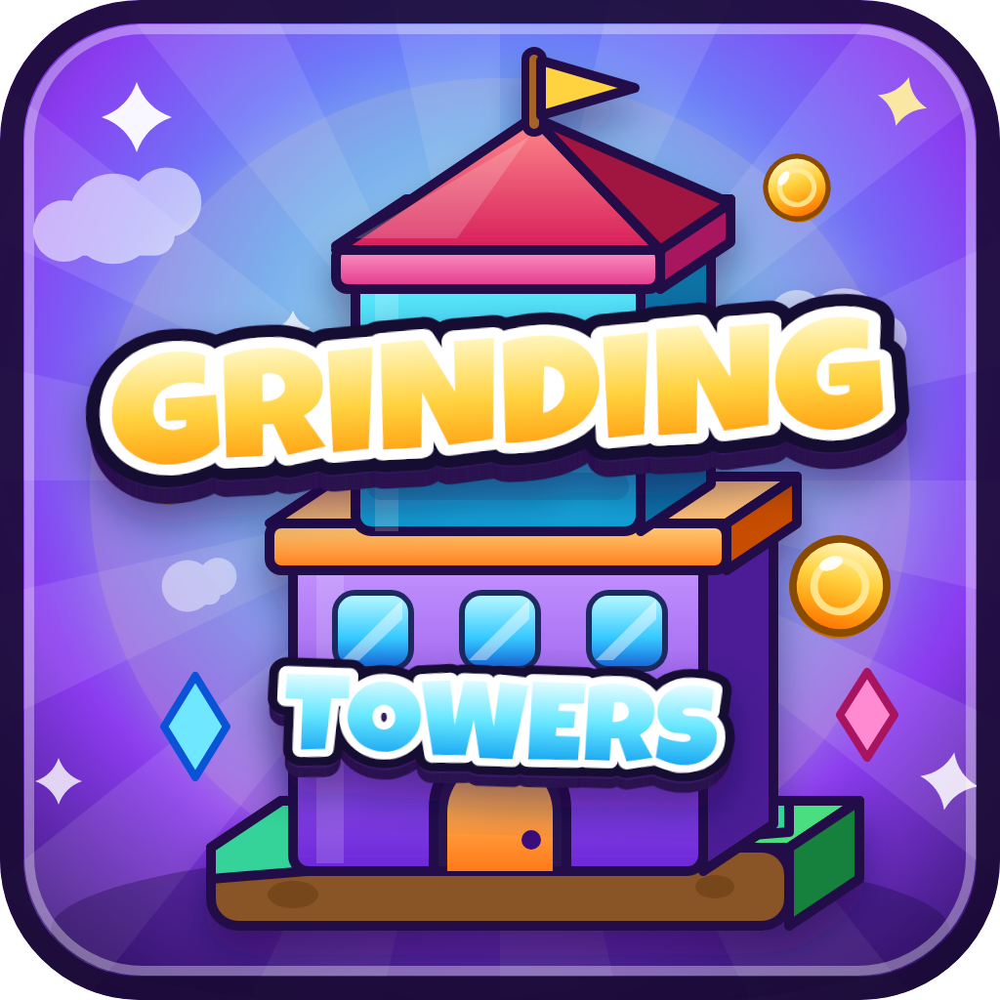

# Grinding Towers — game logo / icon

A Roblox-style stacked-tower game icon: two chunky isometric towers standing on
each other, a big gold **GRINDING** wordmark across the upper tower and a smaller
icy-blue **TOWERS** wordmark across the lower one.



## Files

| File | Size | Use |
| --- | --- | --- |
| `grinding-towers-logo.svg` | vector, 512×512 viewBox | master artwork — scales to any size, font embedded |
| `grinding-towers-logo-1024.png` | 1024×1024 | thumbnails, store art, social |
| `grinding-towers-icon-512.png` | 512×512 | Roblox game icon (the platform's icon slot) |
| `build_logo.py` | — | generator script that produces the SVG |

## Design

- **Composition** — vertical stack: grass/dirt island → bigger violet tower →
  orange cornice → smaller cyan tower → pink cornice → red roof → gold flag.
- **Wordmark** — Luckiest Guy, drawn as a chunky extrude: ~11 stacked dark copies
  for the 3D body, a near-black outer outline, a white inline, then a gradient
  fill (gold for `GRINDING`, ice blue for `TOWERS`). Both words use `textLength`
  so they keep their exact width no matter which font actually renders.
- **Palette** — purple/blue sunburst sky, violet + cyan towers, orange and pink
  trim, gold accents, one dark toon outline (`#241048`) on every solid shape.
- **Icon safety** — everything sits inside a rounded 72px-radius frame with
  margin, so it survives the rounded-corner crop Roblox applies to icons.

## Regenerating

The SVG has the font embedded as base64, so it renders identically anywhere.
To rebuild it:

```bash
npm pack @fontsource/luckiest-guy && tar xzf fontsource-luckiest-guy-*.tgz
python3 build_logo.py            # expects package/files/luckiest-guy-latin-400-normal.woff2
```

To re-export the PNGs, open the SVG in any browser at the target size and
screenshot, or use a headless Chromium screenshot.

Font: [Luckiest Guy](https://fonts.google.com/specimen/Luckiest+Guy) by
Astigmatic, Apache License 2.0.
