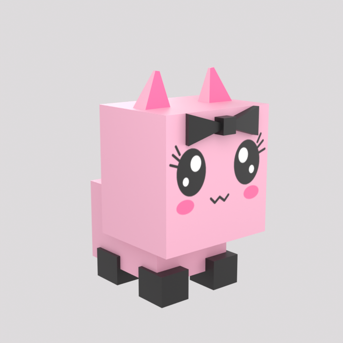

# Kitten — a boxy Pet-Sim style pet for Roblox

A rigged and animated cube kitten, built for Roblox Studio. Hard-edged flat-shaded boxes, ears at
the corners, black bow, and the kawaii face painted on as a texture — the Pet Simulator cube-pet
silhouette in the pink/black/white palette from the reference art.



The whole thing is generated by [`build_kitten.py`](build_kitten.py), so it is reproducible:
change a constant, re-run, get a new build. Nothing was hand-authored in the `.blend`.

## Using your own face artwork

The face is drawn procedurally, but you can replace it with your real artwork:

1. Save your face as a **square** image (PNG, transparency fine) to
   `textures/face_source.png`.
2. Re-run `python3 build_kitten.py`.

It gets resampled into the atlas and projected onto the head box verbatim — the only way to get a
true 1-to-1 with hand-drawn brand art. Transparent areas are composited over the body pink so the
face still sits flush on the box. The build log tells you which face it used.

The head box's front face is deliberately **square**, so square artwork lands undistorted.

## Import into Studio

1. **Model** — Avatar tab → **3D Importer** → select `build/Kitten_Base.fbx`. Studio detects the
   rig and skinning and imports a `Model` containing one `MeshPart` with an 11-bone hierarchy.
   The texture is embedded in the `.fbx`, so it comes in with the mesh.
2. **Animations** — import each clip separately in the **Animation Editor** with the rig
   selected: `Kitten_Idle.fbx`, `Kitten_Bounce.fbx`, `Kitten_Walk.fbx`. They are separate files
   because Roblox only reads one animation track per `.fbx`.
3. Publish each animation and drive them from a script with `Animator:LoadAnimation()`.

If the importer UI differs in your Studio version, the reference pages are
[`3d-importer.md`](../content/en-us/art/modeling/3d-importer.md) and
[`animation/editor.md`](../content/en-us/animation/editor.md).

## Files

| Path | What |
| --- | --- |
| `build/Kitten_Base.fbx` | Rigged mesh, no animation — **import this one as the model** |
| `build/Kitten_Idle.fbx` | Idle clip: breathing bob, ear twitch, tail sway (60f, loops) |
| `build/Kitten_Bounce.fbx` | Happy hop with anticipation and landing (40f, loops) |
| `build/Kitten_Walk.fbx` | Hop-forward cycle, diagonal leg pairs (30f, loops) |
| `build/Kitten.glb` | All three clips in one file — for Unity/Godot/preview, not Studio |
| `textures/Kitten_ALB.png` | 512×512 albedo atlas: drawn face plus flat colour swatches |
| `textures/face_source.png` | *Optional* — drop your own square face art here to override |
| `source/kitten.blend` | Editable Blender source, texture packed |
| `build_kitten.py` | The generator |
| `previews/` | Turnaround renders and one contact sheet per animation |

## Specs

Measured from the built mesh, against
[Roblox's modeling specifications](../content/en-us/art/modeling/specifications.md):

| | This model | Limit |
| --- | --- | --- |
| Triangles | 156 | 20,000 |
| Faces | 78 — **100% quads**, no n-gons | quads where possible |
| Vertices | 104 | |
| Non-manifold edges | 0 (watertight) | must be watertight |
| Materials | 1 | exactly 1 |
| Bone influences per vertex | 1 | 4 |
| Weights on root bone | none | none allowed |
| Size | 46.0 × 65.9 × 79.0 cm = **1.64 × 2.36 × 2.82 studs** | |

The very low triangle count is deliberate — flat-shaded boxes are the whole look, and it makes
the pet essentially free to render even with a lot of them on screen at once.

It stands on the ground plane (feet at Z=0) facing −Y, with `Root` pinned at the origin.

**If it imports at the wrong scale**, that is the classic 100× problem: the scene carries a
0.01 unit scale *and* the FBX exporter has its own scale field, and applying both double-counts.
The exporter here is set to `global_scale=1.0` deliberately. Expect a MeshPart about 2.8 studs
tall — if you get 280 or 0.028, that is what happened. `build/Kitten.glb` is in unambiguous
metres if you need a reference.

### Bones

```
Root                  (origin, non-deforming, carries no weights)
└── Body
    ├── Head
    │   ├── Ear_L
    │   └── Ear_R
    ├── Tail_01 → Tail_02
    └── Leg_FL, Leg_FR, Leg_BL, Leg_BR
```

Bone names survive import, so these are the names you will see in Studio.

## Two Roblox constraints that shaped the build

**Animations carry no scale.** Roblox drives joints with `CFrame`s, which are position and
rotation only. Bone-scale squash-and-stretch would be silently dropped on import, so the bounce
fakes squash by moving parts instead. Keep to location/rotation keys if you add clips.

**One material per mesh.** So a single texture carries everything: the face occupies the
top-left quadrant, and the bottom half is a grid of flat colour swatches that every other face
pins into, with UVs inset so mipmapping can't bleed one colour into its neighbour.

| Swatch | Hex | Used for |
| --- | --- | --- |
| Pink | `#F7B6CE` | head, body, ears, tail, face background |
| Hot pink | `#FF6FA5` | inner ears, blush |
| Black | `#1A1A1A` | bow, feet, eyes, lashes, mouth |
| White | `#FFFFFF` | eye highlights |

## Rebuilding

```bash
pip install bpy==4.5.* numpy
python3 build_kitten.py              # model, rig, clips, exports, previews
python3 build_kitten.py --no-render  # skip the Cycles previews (much faster)
```

Works with Blender-as-a-module or a normal install
(`blender --background --python build_kitten.py`).

The script validates before it exports and **fails rather than shipping a bad model** — it
checks the triangle budget, watertightness, quad-only topology, single material, influence
count, that the root bone is unweighted and at the origin, and that bone rest transforms are
frozen. It then re-imports every exported `.fbx` into a clean scene to confirm the bones,
mesh and animation track actually survived the round trip.

Useful things to change: the `HEAD_*` / `BODY_*` vectors and the part scales in `build_model()`
for proportions, `PALETTE` for colours, the face layout constants above `draw_face()` for the
expression, `BONE_LAYOUT` for the rig, and the `anim_*` functions for motion. Rarity variants in
the Pet Sim mould (gold, rainbow) are close to free — swap the palette hex values and re-run.

## Note on originality

This is an original creature designed in the *style* of Pet Simulator pets — the boxy
proportions, the flat shading, the painted face. It is not a copy of any specific pet from that
game, so it is safe to ship in your own experience.
