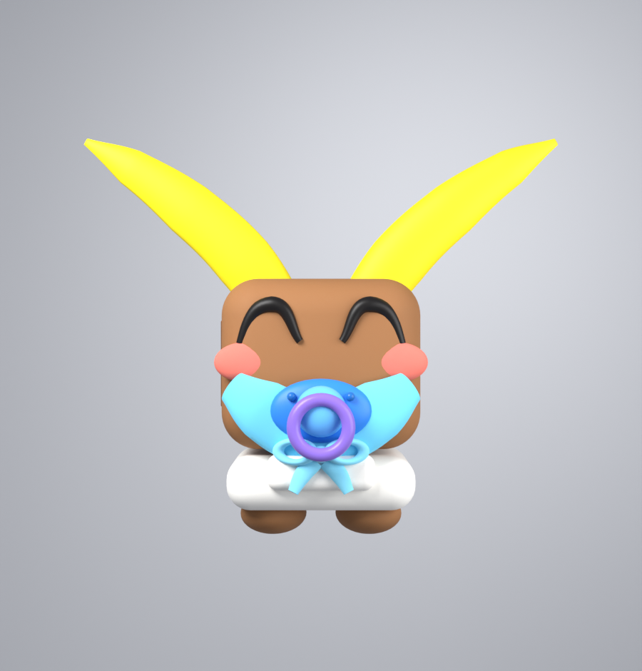

# Big Bebeh — Cookie Collector 🍪

A complete, playable Roblox game: collect cookies, feed them to Big Bebeh, and
his gate opens so you can reach the next area. Five areas, each with a bigger,
hungrier Bebeh than the last.

The whole map builds itself at runtime from a config file — drop the scripts
into an empty place, press Play, and it works.

## The loop

1. **Collect** — cookies lie scattered around each area. Walk over one to grab it.
2. **Fill up** — your hands only hold so many. The bar at the bottom shows how full you are.
3. **Feed** — stand on the glowing pad in front of Big Bebeh and he eats everything you carry, paying out **Sprinkles** ✨ as he goes.
4. **Unlock** — fill his hunger bar and the gate behind him opens *for you*, revealing the next area with better cookies and a bigger carrying capacity.
5. **Upgrade** — spend Sprinkles at the upgrade board or the market stall.
6. **Open runes** — stand on the rune altar for permanent cookie multipliers.
7. **Rebirth** — once BIG BEBEH is full, start over with a permanent multiplier.

| # | Area | Cookie value | Carry capacity | To feed the Bebeh |
|---|------|-------------:|---------------:|------------------:|
| 1 | Cookie Nursery* | 1 | 30 | 60 |
| 2 | Sugar Sandbox | 4 | 120 | 400 |
| 3 | Frosting Fields | 15 | 450 | 1,800 |
| 4 | Choco Chip Canyon | 60 | 1,800 | 9,000 |
| 5 | Golden Crumb Summit | 250 | 7,500 | 45,000 |

\* Zone 1 is a compact 130x130 starter arena rather than the 220x220 the other
zones use. Any area can override `PlatformSize`; bridges are built between real
platform edges, so mixing sizes needs no other change.

## Upgrades

Bought with Sprinkles, earned 1-for-1 for every cookie Big Bebeh eats.

| Upgrade | What it does | Levels | Cost to max |
|---|---|---:|---:|
| 🧤 Bigger Hands | +20% carrying capacity per level | 20 | 105.7K |
| 👟 Sugar Rush | +2 walk speed per level | 15 | 52.4K |
| 🧲 Cookie Magnet | Vacuums cookies from 9 → 36 studs away | 12 | 41.7K |
| ⏱️ Fresh Batch | Cookies respawn faster (5s → 1.4s) | 12 | 62.6K |
| 🍀 Double Chip | +5% chance a cookie counts twice | 10 | 36.3K |

One complete run through all five areas earns about **56K** sprinkles, and maxing
everything costs about **236K** — so it takes roughly four rebirths to finish the
tree. That gap is deliberate: the first upgrade is affordable from area 1 alone,
but no single run can buy out the shop, which is what gives rebirth a point.

## Runes

Zone 1 has a **rune altar**. Stand on the glowing pad and it opens runes by
itself — no button, no cost beyond the time you are not out collecting. The
`✦ RUNES` button opens a menu showing the ladder, how many of each you hold and
what they are worth.

| Rune | Odds | One gives | Maxed at | Maxed gives |
|---|---|---|---:|---|
| Basic Cookie | 1/1 | +x0.1 cookies | 1,000 | +x1 cookies |
| Rare Cookie | 1/7 | +x0.2 cookies | 2,500 | +x2 cookies |

Holding both maxed puts you at **x4 cookies**, stacking on top of the rebirth
multiplier.

The two boost numbers are read exactly as written. A rune declares what ONE is
worth and what a full stack is worth, and `getRuneBoost` solves the curve
between them, so the config reads in the same terms players see. Nothing has to
be hand-tuned when you add a tier — state the two numbers and it fits itself.

Runes also carry effect types the ladder does not use yet — **Rune Luck** (better
odds), **Rune Bulk** (more opens at once) and **Rune Clone** (chance of a double
drop). The plumbing is live, so a future tier only needs an `Effect` field:

```lua
{
    Id = "SkilledCookie", Name = "Skilled Cookie", Odds = 120,
    Effect = "RuneLuck", FirstBoost = 0.05, MaxStack = 500, MaxBoost = 0.5,
    Color = Color3.fromRGB(120, 255, 170),
}
```

Keep `GameConfig.Runes` sorted commonest-first — `rollRune` walks it
rarest-to-commonest and the first tier that hits wins, with the 1/1 tier as the
floor so a roll always yields something.

## Rebirth

Once BIG BEBEH is completely full, the shop's rebirth button lights up. Rebirthing
resets your areas back to the Cookie Nursery but **keeps every upgrade and
sprinkle**, hands you a 2,500-sprinkle bonus, and permanently multiplies
everything you collect by `1 + 0.5 × rebirths`. Your second run is half again as
fast, your third is twice as fast, and so on.

## Game passes — x2 Cookies

There is one pass wired up: **x2 Cookies**, which doubles every cookie you pick
up, forever. Its button sits above SHOP and RUNES in the corner of the screen —
amber while you do not own it, green with a ✓ once you do.

The code is finished, but the pass itself has to exist on **your** Roblox
account before anyone can buy it. Nobody else can create it for you, because it
sells under your name and pays out to you.

1. Go to [create.roblox.com](https://create.roblox.com) → your experience →
   **Associated Items** → **Passes** → **Create a Pass**.
2. Name it `x2 Cookies`, give it an icon, and set the price you want.
3. Open the finished pass. Its id is the number in the address bar:
   `.../game-pass/`**`123456789`**`/x2-Cookies`.
4. Paste that number into `GameConfig.GamePasses`:

```lua
GameConfig.GamePasses = {
	{
		Id = "DoubleCookies",
		Name = "x2 Cookies",
		...
		AssetId = 123456789, -- <- paste your pass id here
		Multiplier = 2,
	},
}
```

Until you do, the button is deliberately inert: clicking it writes a reminder to
the Output window instead of opening a purchase dialog that could only fail.

To add a second pass, add another entry to that table. The button, the ownership
check and the multiplier all follow from it — the only thing a new pass needs
beyond the table entry is a `Multiplier` that means something for your game.

**A note on how ownership is decided.** The server asks Roblox
(`MarketplaceService:UserOwnsGamePassAsync`) once when you join, and listens for
`PromptGamePassPurchaseFinished` so a purchase applies immediately without
rejoining. Ownership is *never* read back from the save file — `sanitize` drops
a `passes` field on purpose — so editing a save cannot hand anyone a pass they
did not pay for. If the ownership check fails (a Roblox outage, say), it fails
closed to "not owned" rather than granting the perk.

## Leaderboards

Four global boards stand in a row in zone 1, under **HALL OF CRUMBS**:

| Board | Tracks |
|---|---|
| 🍪 Most Cookies | lifetime cookies collected |
| ⏱️ Most Playtime | total time played, all sessions |
| ⭐ Most Rebirths | rebirths |
| ✦ Most Runes | runes opened |

Each is an `OrderedDataStore`, top ten, refreshed about every 45 seconds. Adding
a fifth board is one entry in `GameConfig.Leaderboards` naming a number the game
already tracks — the world builds the extra board and the server fills it in.

`Format = "time"` renders seconds as `3h 25m`; anything else abbreviates, so a
cookie count reads `1.5M`.

Both leaderboard stats are **lifetime totals that rebirth does not reset** — the
board is a record of what you have done, not of your current run.

The two loops run at deliberately different speeds. Publishing costs DataStore
budget, so it only writes a value that actually changed, spaces players out
rather than firing every write on one tick, and always writes on the way out the
door. Reading is cheap, and nobody notices a leaderboard being thirty seconds
stale.

Values are floored and clamped to 2^53 before they are published, because
ordered stores hold integers and a cookie total past that would start rounding —
a board that disagrees with the player's own HUD is worse than one that
saturates.

Names are looked up once per user id and cached for the life of the server: the
top ten barely changes between refreshes, and each lookup is a web call. A
failed lookup falls back to the id rather than dropping the row, because a board
with one odd-looking name beats a board with a hole in it.

To wipe a board and start it again, bump `GameConfig.LeaderboardVersion`. The old
ordered store is abandoned rather than migrated, which is the cheap and honest
way to reset a leaderboard.

## Editing the map by hand

By default `WorldBuilder` wipes `Workspace.BigBebehWorld` and regenerates it on
every server start. That is what makes the map build itself from config — and it
is also why editing the map in Studio appears to do nothing. The edits are real;
they are deleted a moment later.

To take ownership of the map, run **`tools/4_EditableMap.lua`** once in Studio
(edit mode, not while playing), then **save the place**. It builds the map if it
is not already there and sets a `HandEdited` attribute on the folder. From then
on the server adopts what is in the place instead of generating.

After that, edit freely: move things, restyle them, delete the scenery, build
whole new zones.

**What has to stay.** The server finds things by CollectionService tag, never by
name or position, so anything keeps working as long as the tag is on the part
you want to play that role:

| Tag | What it is | Attributes it needs |
|---|---|---|
| `BigBebeh` | the model you feed | `AreaIndex` |
| `FeedPad` | the pad you stand on | — |
| `AreaGate` | the gate into an area | `AreaIndex` |
| `RuneCrystal` | the rune altar crystal | — |
| `UpgradeBoard` | the face the upgrade GUI draws on | — |
| `Leaderboard` | a leaderboard face | `BoardId` |
| `ShopPrompt` | the shop's ProximityPrompt | — |

Cookies are still spawned by the server at runtime into the `Cookies` folder,
inside each area's pit as set by `GameConfig`. Any cookies left lying in the
folder from an edit session are cleared on start, so they do not pile up.

To go back to a generated map, clear the `HandEdited` attribute (or delete the
folder) and press Play.

## Keeping map edits while the map code still changes

`HandEdited` freezes the map: your edits stay, but changes to `WorldBuilder` and
`GameConfig` stop showing up. That is the wrong trade while you are still
writing map code. `MapKeep` does the other thing — the map regenerates every
start, and your edits are replayed on top.

Two kinds of edit, handled two ways:

- **Things you built.** Put them in `Workspace.BigBebehWorld.Custom`. That folder
  is lifted out before the rebuild and put back after, so it is never touched.
  Nothing needs recording.
- **Things you changed** — a shop you dragged, a fence you recoloured, scenery
  you deleted — are recorded in a `MapEdits` ModuleScript by
  `tools/5_SaveMapEdits.lua` and replayed after every build.

The workflow: edit the map in Studio → run `5_SaveMapEdits` → save the place.
Then change map code as much as you like; each rebuild regenerates and re-applies.
Run the tool again whenever you edit more — it rewrites the file from scratch, so
it always describes the map as it stands.

An override has to name the part it belongs to, and generated parts share names
by the hundred (`Fence`, `Bush`). So every generated instance is stamped with a
**BuildId**: its path plus its position among same-named siblings, e.g.
`Areas/Area1_Cookie Nursery/Shop/Post#2`. Generation is deterministic, so the
same part gets the same id every run.

**The honest limit:** change the code so a part is no longer generated and its
override has nowhere to land. Those are counted and warned about rather than
silently dropped, so you find out instead of wondering where an edit went. Adding
another part of the *same name in the same parent* also shifts the ones after it;
re-run the tool after a change like that.

Stamping only ever fills in a *missing* id — an id already on a part is kept.
Ordinals are positional, so reassigning them would mean deleting one part shifted
every later sibling onto its neighbour's id, and that sibling's recorded edits
would land on the wrong thing. A part duplicated by hand arrives carrying the
original's id and is given a fresh one rather than shadowing it.

`5_SaveMapEdits` refuses when fewer than half the generated parts match the map
it just built, because "almost nothing matched" is two maps that do not
correspond, and recording that would write a `MapEdits` that empties the world.
It also clears a `MapEdits` already full of deletions rather than leave it armed.

When a map tool says something surprising, **`tools/0_MapStatus.lua`** is the
first thing to run: it only reads, and it reports what is in Workspace, how much
of it is stamped, and what `MapEdits` will do on the next build.

## Anti-cheat

Two modules under `ServerScriptService/BigBebehGame`:

- **`SessionLock`** — stops duplication.
- **`AntiCheat`** — throttling, movement checks, strikes, Discord reports.

### What actually protects the game

An exploiter runs arbitrary Lua on their own machine. Anything a LocalScript
checks, they can delete — so there is no such thing as client-side anti-cheat,
only server checks and speed bumps. Everything here runs on the server.

The real protection was already in place before either module existed: the server
owns the economy. The client asks for an upgrade *by name* and the server decides
the price; cookies are added by the server after a distance check; no number the
client sends is ever used. Nothing in `collect`, `feed` or `BuyUpgrade` yields
part-way through, so there is no race to wedge a second request into.

### Duplication

The one genuine dupe vector was **cross-server rollback**: be in two servers at
once, spend in one and bank in the other, and whichever saves last wins — so the
currency you spent is still there. No amount of validation inside the game loop
prevents that, because both servers are behaving correctly on stale data.

`SessionLock` fixes it by making save ownership a single value only one server
can hold. Each session claims the key with `UpdateAsync` (atomic, so two servers
claiming at once cannot both win), refreshes the claim every 30s while playing,
and drops it on the way out. A server that finds a live claim refuses to load and
kicks with an explanation rather than starting from stale data.

A claim expires after 90s without a refresh, so a server crash costs the player a
short wait rather than locking them out of their own save forever.

A failed claim splits two ways, and they get opposite answers:

- **Another server holds it** — refuse, always. That is the duplication this
  exists to stop.
- **The DataStore could not be reached at all** — a live server still refuses,
  because letting somebody play from a default state and then saving it would
  overwrite the progress they already had, which is worse than making them wait.
  **Studio** instead drops to the no-saves mode the game has always had: there is
  no second server and nothing persists, so nothing can be duplicated and nothing
  can be lost, and locking a developer out of their own game over a settings
  checkbox is pure friction.

That Studio case is almost always **Game Settings → Security → Enable Studio
Access to API Services** being switched off. Turn it on to test saving; leave it
off and the game still runs, just without saves, and says so in the Output.

### What gets detected

| Rule | Strikes | What trips it |
|---|---|---|
| `Speed` | 1 | 3 consecutive samples faster than walk speed × 1.6 + 8 studs |
| `Teleport` | 2 | a single 0.5s sample longer than 150 studs |
| `Flight` | 2 | 6s airborne without losing height |
| `RemoteSpam` | 1 | a remote called far past its token allowance |
| `BadPayload` | 3 | a remote sent an argument the real client never sends |

Six strikes kicks. Strikes decay after 5 minutes each, so somebody who trips one
check once an hour never escalates while somebody flying does. Banning is off by
default (`BanAt = 0`) — watch the channel for a while before turning it on.

Roblox gives the client physics ownership of its own character, so a laggy player
genuinely does look like a short teleport. That is why the thresholds are loose,
why speed needs three consecutive bad samples, and why one detection alone does
nothing. Tune in `AntiCheat.Settings` once you have seen real traffic.

The game teleports players itself (rebirth, the void catcher, respawn). Each of
those calls `AntiCheat.pardon`, without which the game's own teleports would
report as exploits. **If you add another teleport, pardon it too.**

### Discord webhook

**Discord will not accept a webhook posted straight from a Roblox server.** It
blocks Roblox's address range and returns 403 with nothing useful in it. This
catches everybody once. You need a small proxy in between.

A Cloudflare Worker does it free, at `workers.cloudflare.com` → Create Worker:

```js
export default {
  async fetch(request, env) {
    if (request.method !== "POST") return new Response("nope", { status: 405 });
    return fetch(env.DISCORD_WEBHOOK, {
      method: "POST",
      headers: { "content-type": "application/json" },
      body: await request.text(),
    });
  },
};
```

Put your real Discord webhook URL in a Worker **secret** named
`DISCORD_WEBHOOK` (Settings → Variables → Add secret, not a plain variable) so
the URL never appears in your game code — anyone who can read your scripts could
otherwise spam your channel. Then set the Worker's own URL in `AntiCheat.luau`:

```lua
AntiCheat.WebhookUrl = "https://your-worker.workers.dev"
```

Leave it empty and reports go to the Output window instead, which is the right
setting while you are testing.

You also need **Game Settings → Security → Allow HTTP Requests** turned on.

Reports are queued and flushed every 3 seconds, up to Discord's limit of 10
embeds per message, and repeats of the same rule by the same player inside 30
seconds collapse into a single `(x25)` count. That is not tidiness: a flying
player trips the check twice a second, and a webhook firing that often gets
rate-limited by Discord and drowns the channel. Each report carries the display
name, @username, user id, a profile link, the strike count, and the numbers that
triggered it.

## Installing into an existing place

If the game is already in Studio and you just want the newer systems, two
scripts do it. Paste each into the Studio Command Bar (or a bridge plugin) and
run them **in order**:

| Script | What it does |
|---|---|
| `tools/1_InstallModules.lua` | creates `SessionLock`, `AntiCheat` and `Leaderboard` under `ServerScriptService.BigBebehGame` |
| `tools/2_PatchHooks.lua` | wires them into `GameConfig`, `WorldBuilder`, `PlayerState` and the `BigBebehGame` script |

Step 1 never edits an existing script — those carry your own changes, and
overwriting them to save a few edits is a bad trade. It reports which hook-ins
are missing instead, and step 2 applies exactly those.

If a step ever reports `BLOCKED` or `MISSED`, stop and read it: something in
your copy has drifted from what the patch expected. `tools/3_FixLeaderboardBuilder.lua`
repairs the one case that has bitten in practice — a `buildLeaderboards` call
with no definition — by adding only what is missing, never replacing your file.

**Anchor on code, not on comments.** A patch that anchored on the text of a
comment above `buildRuneAltar` missed on a copy where that comment had been
reworded, while the patch adding the *call* still matched — leaving a call with
no definition and a server that would not start. Anchors are now structural
(`local function buildArea`), and a call-site patch refuses to apply unless its
definition is already in place above it.

Step 2 is anchored find/replace: each change matches one exact region, skips
anything already applied, and reports a miss rather than guessing — including
when an anchor matches twice, since picking one at random is worse than doing
nothing. A patch that inserts a *call* also refuses to apply unless the patch
that inserts the *definition* already landed, and landed above it — in Lua a
`local function` declared after its call site is nil there, so half-applying
that pair turns a working game into "attempt to call a nil value". Both are safe to re-run, and both print a report and return it, so a
bridge plugin shows the result in its own box.

## Installing from scratch

### Option A — open the place file (easiest)

Download **`BigBebehCookieCollector.rbxlx`** from this folder and either
double-click it, or in Studio use **File → Open from File…** and pick it.
Everything is already wired up — press **Play**.

To put it into a game you are already working on instead, use
**File → Open from File…** to open it as its own place, then copy
`BigBebehShared`, `BigBebehGame` and `BigBebehClient` across.

### Option B — Rojo

```sh
rojo serve   # from this folder, then connect from the Roblox Studio plugin
```

### Option C — by hand in Studio

Create these and paste in the matching file's contents:

| Studio location | Instance | Name | File |
|---|---|---|---|
| `ReplicatedStorage` | Folder | `BigBebehShared` | — |
| `ReplicatedStorage/BigBebehShared` | ModuleScript | `GameConfig` | `src/ReplicatedStorage/BigBebehShared/GameConfig.luau` |
| `ReplicatedStorage/BigBebehShared` | ModuleScript | `Remotes` | `src/ReplicatedStorage/BigBebehShared/Remotes.luau` |
| `ReplicatedStorage/BigBebehShared` | Folder | `UI` | — |
| `ReplicatedStorage/BigBebehShared/UI` | ModuleScript | `Theme` | `src/ReplicatedStorage/BigBebehShared/UI/Theme.luau` |
| `ReplicatedStorage/BigBebehShared/UI` | ModuleScript | `Components` | `src/ReplicatedStorage/BigBebehShared/UI/Components.luau` |
| `ServerScriptService` | **Script** | `BigBebehGame` | `src/ServerScriptService/BigBebehGame/init.server.luau` |
| `ServerScriptService/BigBebehGame` | ModuleScript | `PlayerState` | `src/ServerScriptService/BigBebehGame/PlayerState.luau` |
| `ServerScriptService/BigBebehGame` | ModuleScript | `WorldBuilder` | `src/ServerScriptService/BigBebehGame/WorldBuilder.luau` |
| `ServerScriptService/BigBebehGame` | ModuleScript | `BebehBuilder` | `src/ServerScriptService/BigBebehGame/BebehBuilder.luau` |
| `StarterPlayer/StarterPlayerScripts` | LocalScript | `BigBebehClient` | `src/StarterPlayer/StarterPlayerScripts/BigBebehClient.client.luau` |

`PlayerState`, `WorldBuilder` and `BebehBuilder` go **inside** the `BigBebehGame`
Script as children — that is what `require(script.PlayerState)` refers to.

Then hit Play. The world (platforms, bridges, gates, Bebehs, cookies) is
generated on server start, so you do not need to build anything yourself.

## The UI design system

`ReplicatedStorage/BigBebehShared/UI` holds the interface foundation, and every
screen is being moved onto it one at a time.

**`Theme`** is the token file. No screen hard-codes a colour, a text size or a
gap — they all come from here, so the game restyles from one place. It encodes
three things worth keeping: one dark ground with a few saturated accents that
each own a concept (cookie / sprinkle / rune / good / bad), a six-step type
scale so hierarchy reads instantly, and a 4px spacing grid — `Theme.space(3)` is
12px. That grid is most of why a layout looks deliberate rather than nudged
into place.

**`Components`** is the widget library: `panel`, `pill`, `bar`, `button`,
`label`, plus `list` and `padding` helpers. One definition per widget, so a
panel looks the same everywhere instead of thirty hand-set Frames drifting
apart. Each constructor takes `(parent, props)`, applies props last so callers
can override anything, and parents the instance itself so it cannot be
forgotten.

`bar` returns a setter rather than the fill frame, so callers pass a 0-1 ratio
and cannot forget to clamp. `button` captures its rest size once for the press
animation — reading `Size` at click time would measure a half-finished tween and
the button would shrink a little with every press.

`modal` is the shared shell for full-screen menus — panel, header with title
and close button, and a body to fill — so the shop and rune screens do not each
re-invent their own chrome. `chip`, `row` and `scroller` cover the rest of what
a list screen needs.

Every screen is now on the system: currency rail, bottom HUD, shop, rune menu
and the world upgrade board. The old inline helpers are gone, so there is one
definition of a panel, a button and a bar in the whole project.

## Seeing the map in Studio

The world is generated when the **server starts**, so in edit mode Workspace is
empty and there is no GUI — client scripts do not run until you press Play. That
is expected, not a bug.

To look at the map while editing, paste `tools/BuildMapInStudio.lua` into
Studio's **Command Bar** (View → Command Bar) and press Enter. The whole map
appears under `Workspace.BigBebehWorld`. Undo removes it.

That preview is only for measuring and positioning: the map is rebuilt from
`GameConfig` on every server start, so anything you place inside `BigBebehWorld`
is discarded when you press Play. To change the map for real, edit `GameConfig`.

Note you do **not** need the map visible to install the Bebeh mesh — importing it
to `ServerStorage` as `BigBebeh` is all that is required, and the game positions
it for you.

## The Blender models

`models/` holds a sculpted Big Bebeh and a sculpted cookie, both generated by
`tools/build_models.py` (a headless Blender script — the `.blend` is included if
you want to open and tweak him).



| | Objects | Triangles |
|---|---:|---:|
| `BigBebeh.fbx` | 27 | 44,504 |
| `BigBebehCookie.fbx` | 9 | 5,084 |

Every mesh is well under Roblox's 10k-triangles-per-MeshPart limit.

### Importing them

A script cannot upload a mesh to Roblox, but Studio's importer reads a file
straight off disk, so this takes about a minute:

1. **File → Import 3D…**, pick `models/BigBebeh.fbx`.
2. In the import dialog leave the defaults and click **Import**.
3. Drag the resulting model into **ServerStorage** and name it exactly `BigBebeh`.
4. Repeat with `models/BigBebehCookie.fbx`, naming that one `CookieModel`.

Press Play. Every Bebeh in the game becomes the sculpted mesh, and every cookie
becomes the sculpted cookie. Nothing else needs changing.

**A raw import looks huge and grey — that is expected.** Roblox's importer picks
its own unit scale, and FBX material colours are not carried across, so the
MeshParts arrive plain. The game fixes both when it clones him at runtime, so he
is correct the moment you press Play.

If you would rather see him fixed straight away in the editor, paste
`tools/SetupBebehImport.lua` into the Command Bar. It tints every part, rescales
him to the height the game uses, and files him into ServerStorage under the right
name — the same work the game does, just done now so you can look at him.

Two things happen automatically so the import "just works":

- **Colours.** The importer keeps the Blender object names (`Head`, `EarInnerL`,
  `PaciRing`…) on the MeshParts, and `BebehBuilder` tints each one by matching
  the longest name prefix. You never have to colour 27 parts by hand.
- **Scale.** Studio's importer picks its own unit scale, so `normalizeHeight`
  rescales him to a known 33 studs before applying each area's multiplier. He
  comes out the right size whatever the dialog decides.

If you re-export from Blender, keep the object names — they are the contract
between the model and the colouring code.

## Changing how Big Bebeh looks

There are several ways to get a Bebeh, and the game picks the first available:
the `BigBebeh` model in ServerStorage (above), then an image, then parts.

### 1. Your own artwork

Roblox will not let a script upload an image — asset ids only exist once *you*
have uploaded the file to *your* account. Once you have, it is a one-line change.

1. Go to [create.roblox.com](https://create.roblox.com) → **Development Items →
   Decals** → **Upload Decal**, and upload your picture.
2. Open the decal you just uploaded and copy the number out of its URL.
3. In `GameConfig.luau`, set:

   ```lua
   GameConfig.BebehImageId = "rbxassetid://123456789"
   ```

Every Bebeh becomes a cutout of your image, printed on both faces and scaled per
area. If it comes out stretched, adjust `GameConfig.BebehImageAspect` to your
image's real width ÷ height.

> Moderation usually takes a minute or two, and a brand-new decal id renders
> blank until it clears. If the cutout is invisible, wait and rejoin before
> assuming the id is wrong.

### 2. A model you built

Put a Model named `BigBebeh` in **ServerStorage**. Each area clones it, tints any
parts whose names it recognises, normalises the height and scales it by that
area's `BebehScale`, so one model covers all five sizes. This beats every other
option — it is also what the Blender import above uses.

### 3. The built-in part model (fallback)

Roblox has no rounded-box primitive, so every chunky shape on him is assembled
the way modelling packages do it — a core of slabs, cylinders along each edge and
spheres at each corner. That is what stops him reading as a stack of bricks. He
comes out at 159 parts: rounded head, two-segment floppy ears with inner shading,
sleepy eyes drawn as an arc of beads, blush, a bib with shoulder straps and a
bow, a pacifier whose ring is a twelve-bead torus, plus diaper, feet and tail.

A single invisible box does all the colliding, so players bump into a clean shape
instead of snagging on ears and pacifier beads.

## Tuning

Everything is in `src/ReplicatedStorage/BigBebehShared/GameConfig.luau`:

- `Areas` — add, remove or reorder areas. The map, gates, cookies, shops and
  Bebehs all follow automatically. Names, colours, cookie values, capacities and
  hunger goals live here.
- `Upgrades` — each entry's `BaseCost` and `CostMultiplier` set the curve;
  `MaxLevel` caps it. Add an entry and a new shop row appears by itself, though a
  brand-new upgrade id also needs its effect wiring up in the helpers below the
  table.
- `GamePasses` — paid perks. `AssetId` is the id Roblox gives your pass; leave it
  at `0` and the button stays inert instead of prompting a purchase that cannot
  complete. See [Game passes](#game-passes--x2-cookies) above.
- `SprinklesPerCookieFed` / `RebirthMultiplierPerLevel` — the economy dials.
- `FeedRadius` — how close you must stand to feed him.
- `CookieRespawnTime` — how quickly a collected cookie comes back.
- `SaveEnabled` — set to `false` to disable DataStore saving while testing.

Adding a sixth area is just one more entry in the `Areas` table.

Note that the DataStore key is `BigBebehCookies_v2`. Saves written by the earlier
version load fine — missing upgrade fields default to zero — but if you want a
clean slate, bump the name again.

## How it fits together

**Server** (`init.server.luau`) is the authority. It builds the world, spawns
cookies, handles pickups (`Touched`, with a distance sanity check), runs the
auto-feed and magnet proximity loops, prices and applies upgrades, decides when
an area unlocks, and saves progress. The client never sends a number — it asks
for an upgrade *by id* and the server looks up what that costs.

**Client** (`BigBebehClient.client.luau`) draws the HUD, spins the cookies, bobs
the Bebehs, and — importantly — opens gates *locally*. Progress is per-player, so
the gate has to be solid for one player and invisible for another standing right
next to them. The client turns off `CanCollide` only for areas the server has
already told it are unlocked; the server never trusts the client for anything
that matters.

**Saving** uses a DataStore, with everything loaded back through a `sanitize`
pass so an old or corrupt save can never hand a player an out-of-range area or a
negative cookie count. Progress autosaves every two minutes, on leave, and on
server shutdown.

Notes:

- Studio needs **Game Settings → Security → Enable Studio Access to API Services**
  for saving to work locally. Without it the game still runs, just without saves.
- The build deletes the default `Baseplate` and any existing `SpawnLocation` so
  they do not sit in the middle of the generated map.
